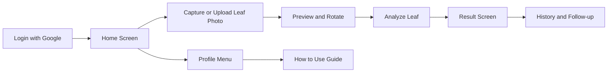

# LeafCure

LeafCure is a Flutter application for detecting tea leaf diseases from images.
The app handles sign-in, image capture, optional weather-assisted analysis,
result display, and prediction history. The mobile client lives in this
repository; the machine learning inference API is configured externally through
environment variables.

This documentation is written for two audiences:

- Beginners who want clear setup steps and plain-language explanations.
- Maintainers who need architecture, release, and integration details.

## What the app does

- Authenticates users with Google Sign-In and Supabase Auth.
- Lets users capture a photo or choose one from the gallery.
- Sends the image to an external `/analyze_leaf` API endpoint.
- Optionally includes device location so the backend can apply weather logic.
- Shows diagnosis details, confidence, and built-in cure guidance.
- Stores and displays previous predictions through Supabase-backed history.

## Product flow



## Tech stack

| Area | Technology |
| --- | --- |
| UI client | Flutter |
| Authentication | Google Sign-In + Supabase Auth |
| Database and storage | Supabase database and `leaf_images` storage bucket |
| HTTP integration | `http` multipart upload |
| Runtime configuration | `flutter_dotenv` |
| Optional location input | `geolocator` |
| Target focus | Android-first Flutter app, with other Flutter platform folders present |

## Quick start

### 1. Prerequisites

Install the following before running the app:

- Flutter SDK
- Android Studio or another Android-capable Flutter setup
- A Supabase project
- Google OAuth credentials for sign-in
- Access to the backend inference API that serves `/analyze_leaf`

If you are new to Flutter, use the official installation guide:
<https://docs.flutter.dev/get-started/install>

### 2. Clone and install dependencies

```bash
git clone <your-repository-url>
cd LeafCure_App
flutter pub get
```

### 3. Create your `.env` file

Copy the example file:

```bash
cp .env.example .env
```

Fill the required values:

| Variable | Purpose |
| --- | --- |
| `SUPABASE_URL` | Supabase project URL used by `Supabase.initialize()` |
| `SUPABASE_ANON_KEY` | Public anon key for the client app |
| `GOOGLE_WEB_CLIENT_ID` | Web OAuth client ID used by Google Sign-In |
| `PRODUCTION_BASE_URL` | Base URL for the backend API, for example a Hugging Face Space |

### 4. Choose backend mode

The app currently reads its API base URL from
`lib/pages/config.dart`.

- Production mode: leave `EnvironmentConfig.isDevelopment = false`
  and set `PRODUCTION_BASE_URL` in `.env`.
- Local Android emulator mode: change `isDevelopment` to `true`.
  The built-in local URL is `http://10.0.2.2:8000`.

Beginner note:
`10.0.2.2` only works for the Android emulator. If you test on a real device,
you will need to point the app to a reachable machine or hosted backend instead.

### 5. Run the app

```bash
flutter run
```

Once the app launches:

1. Sign in with Google.
2. Tap `Click a Photo`.
3. Choose `Camera` or `Gallery`.
4. Preview the image and tap `Analyze Image`.
5. Review the result and history screens.

## Common commands

```bash
flutter pub get
flutter run
flutter analyze
flutter test
flutter build apk --release
```

## Repository guide

| Path | Purpose |
| --- | --- |
| `lib/main.dart` | App bootstrap, `.env` loading, Supabase initialization |
| `lib/pages/login_page.dart` | Google Sign-In and app entry screen |
| `lib/pages/home_page.dart` | Main dashboard and feature entry points |
| `lib/pages/capture_page.dart` | Camera/gallery image selection |
| `lib/pages/preview_page.dart` | Preview, rotate, and confirm image |
| `lib/pages/loading_page.dart` | Multipart upload and API request |
| `lib/pages/result_page.dart` | Diagnosis result and cure display |
| `lib/pages/history_page.dart` | Prediction history backed by Supabase |
| `lib/pages/account_page.dart` | Profile menu and account actions |
| `lib/pages/how_to_use_page.dart` | Beginner-friendly in-app help page |
| `docs/` | Project, setup, architecture, and operational docs |

## Important integration notes

- The backend inference service is not included in this repository.
- The result UI expects the backend to return fields such as
  `final_prediction`, `final_confidence`, `vote_count`, `total_models`,
  `details`, and optionally `weather_data`.
- History functionality expects a Supabase table named `predictions`
  and a storage bucket named `leaf_images`.
- Weather data is optional and is only requested when the user enables
  `AI + Weather Logic`.

## Supported result labels in the current UI

The built-in cure text in the app currently maps these labels:

- `healthy`
- `brown_blight`
- `gray_blight`
- `red_rust`
- `algal_leaf_spot`
- `algal_spot`
- `helopeltis`
- `red_spot`

## Documentation map

- [docs/README.md](docs/README.md) - documentation index and reading order
- [docs/getting_started.md](docs/getting_started.md) - beginner-friendly local setup
- [docs/architecture.md](docs/architecture.md) - system architecture and integrations
- [docs/user_guide.md](docs/user_guide.md) - end-user walkthrough
- [docs/google_signin_android_fix.md](docs/google_signin_android_fix.md) - Android Google login troubleshooting
- [docs/android_release_guide.md](docs/android_release_guide.md) - signed APK and GitHub release workflow

## Troubleshooting

- Android Google login error `ApiException: 10`:
  see [docs/google_signin_android_fix.md](docs/google_signin_android_fix.md)
- Release APK setup and GitHub tag workflow:
  see [docs/android_release_guide.md](docs/android_release_guide.md)

## Suggested next improvements

- Add screenshots or short GIFs for the login, capture, and result screens.
- Document the backend API repository and Supabase schema in more detail.
- Expand widget and integration test coverage beyond the current basic UI test.
