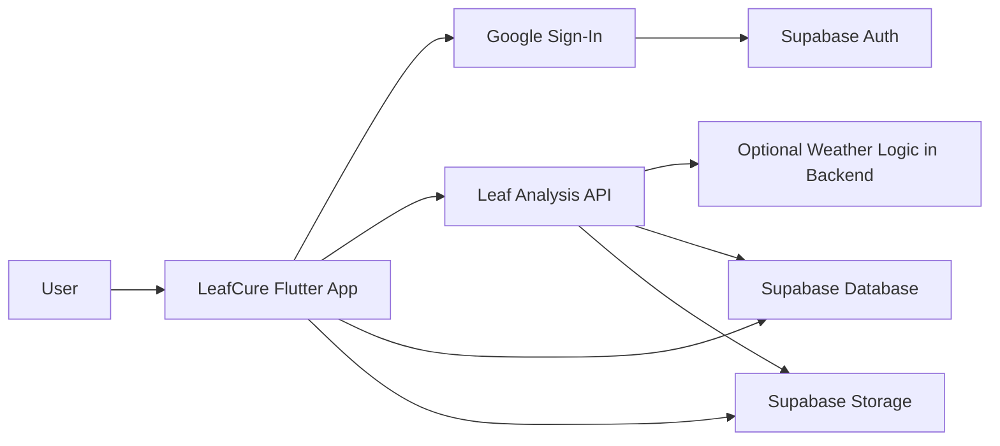
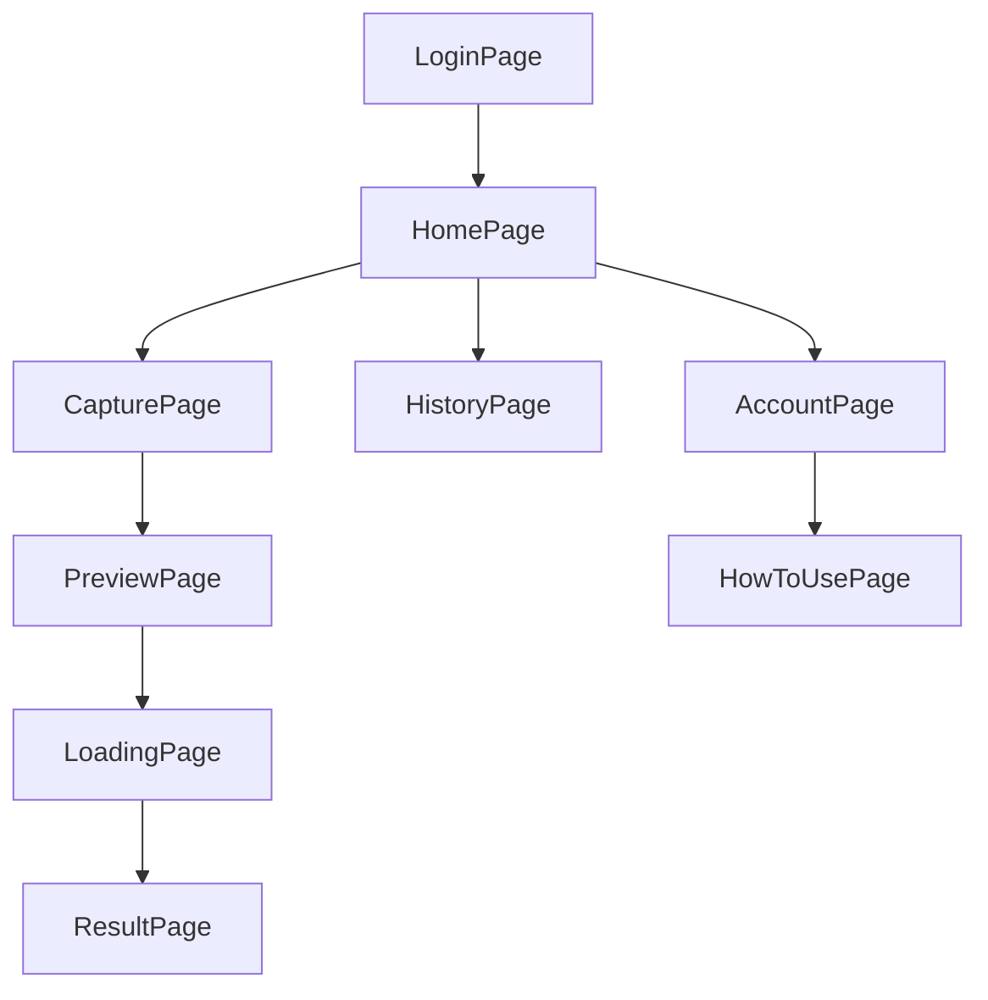

# Architecture and Integrations

This document explains how the LeafCure Flutter client is structured and how it
connects to external systems.

## 1. High-level architecture



## 2. Screen flow



## 3. Runtime responsibilities by screen

| Screen | Responsibility |
| --- | --- |
| `LoginPage` | Google OAuth sign-in and Supabase session creation |
| `HomePage` | Main entry point for analysis, history, and profile actions |
| `CapturePage` | Acquire image from camera or gallery |
| `PreviewPage` | Let the user verify and rotate the image |
| `LoadingPage` | Build and send the analysis request |
| `ResultPage` | Render diagnosis, confidence, cure text, and weather summary |
| `HistoryPage` | Load, display, and delete stored predictions |
| `AccountPage` | Show user details and account actions |
| `HowToUsePage` | Beginner-friendly in-app guidance |

## 4. Configuration model

LeafCure loads runtime configuration from `.env` in `main.dart`.

### Environment values used by the app

| Variable | Used for |
| --- | --- |
| `SUPABASE_URL` | Supabase client initialization |
| `SUPABASE_ANON_KEY` | Supabase client initialization |
| `GOOGLE_WEB_CLIENT_ID` | Google Sign-In configuration |
| `PRODUCTION_BASE_URL` | Default backend API base URL |

### Environment selection

`lib/pages/config.dart` defines the current API selection strategy:

- `isDevelopment = false` uses `PRODUCTION_BASE_URL`
- `isDevelopment = true` uses `http://10.0.2.2:8000`

This makes the current setup simple, but it also means backend mode is a code
change rather than a runtime flag. If the project grows, moving this to
environment variables or build flavors would be cleaner.

## 5. Request flow for analysis

The analysis request is assembled in `LoadingPage`.

### Request endpoint

```text
POST /analyze_leaf
```

### Request content

The client sends a multipart form request. Based on the current code, it can
include these fields:

| Field | Type | When included |
| --- | --- | --- |
| `file` | image file | Always |
| `user_id` | string | When the user is logged in |
| `use_weather` | string boolean | Always |
| `lat` | string | When weather logic is enabled and location is available |
| `lon` | string | When weather logic is enabled and location is available |

## 6. Expected response shape

The backend service is external, but the current result UI expects a response
that looks conceptually like this:

```json
{
  "final_prediction": "brown_blight",
  "final_confidence": 87.2,
  "vote_count": 3,
  "total_models": 4,
  "details": [
    {
      "model_name": "model_a",
      "prediction": "brown_blight",
      "confidence": 86.1
    }
  ],
  "weather_data": {
    "avg_temp_30d": 27.4
  }
}
```

Notes:

- `weather_data` is optional.
- `details` is used by the expandable "View AI Analysis Details" section.
- `final_prediction` drives the disease label and cure text mapping.

## 7. Supabase expectations

The history flow shows what the client expects to exist in Supabase.

### Authentication

- Supabase Auth must be initialized successfully at app startup.
- Google must be configured as an auth provider.

### Database

The app queries a table called `predictions`.

Based on the current code, useful fields include:

- `id`
- `user_id`
- `prediction`
- `confidence`
- `analysis_data`
- `image_path`
- `created_at`

### Storage

The app reads and deletes files from a bucket named `leaf_images`.

The history screen supports:

- signed URL generation for private buckets
- public URL fallback for public buckets
- storage cleanup when a history entry is deleted

## 8. Built-in cure mapping

The UI currently provides canned cure text for these labels:

- `healthy`
- `brown_blight`
- `gray_blight`
- `red_rust`
- `algal_leaf_spot`
- `algal_spot`
- `helopeltis`
- `red_spot`

If the backend returns a new class that is not listed above, the UI falls back
to a generic message asking the user to consult a local agricultural expert.

## 9. Project structure

```text
lib/
  main.dart
  pages/
    account_page.dart
    capture_page.dart
    config.dart
    history_page.dart
    home_page.dart
    how_to_use_page.dart
    loading_page.dart
    login_page.dart
    preview_page.dart
    result_page.dart
docs/
  README.md
  getting_started.md
  architecture.md
  user_guide.md
  android_release_guide.md
  google_signin_android_fix.md
scripts/
  show_android_debug_sha.sh
```

## 10. Operational workflows

### Sign-in flow

1. User taps `Login with Google`.
2. App requests Google tokens.
3. App exchanges those tokens with Supabase.
4. On success, the user enters the home screen.

### Analysis flow

1. User selects an image.
2. App optionally requests location.
3. App uploads the image and metadata to the backend.
4. App navigates to `ResultPage` with the parsed response.

### History flow

1. App fetches predictions for the current `user_id`.
2. App resolves image URLs from Supabase Storage.
3. User can reopen results or delete an entry.

## 11. Current limitations

- The backend repository and deployment details are not documented here because
  they are not in this repo.
- Environment mode selection is a code constant, not a flexible runtime config.
- Automated tests are still light relative to the number of screens.
- Some older files still contain commented legacy code and lint warnings.

## 12. Recommended future improvements

- Add formal API contract documentation for `/analyze_leaf`.
- Add a schema migration or SQL doc for the `predictions` table and `leaf_images`
  bucket setup.
- Move environment mode handling to build flavors or environment files.
- Add integration tests for login, upload, and history deletion.
